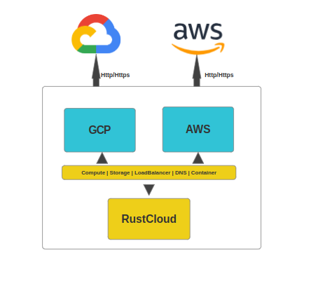

# RustCloud
RustCloud  is a rust library which hides the difference between different APIs provided by varied cloud providers (AWS, GCP, Azure etc.) and allows you to manage different cloud resources through a unified and easy to use API.
<!-- 


[](https://www.codacy.com/app/cloudlibz/gocloud?utm_source=github.com&utm_medium=referral&utm_content=cloudlibz/gocloud&utm_campaign=Badge_Grade)
[](https://travis-ci.org/cloudlibz/gocloud)
[](https://gitter.im/cloudlibz/gocloud)
[](docs) -->





## Service Types

**Compute** -- Allows you to manage cloud and virtual servers.

**Database** -- Allows you to manage Compute storage.

**Container** -- Allows users to install and deploy containers onto container based virtualization platforms.

**Load balancer** -- Allows you to manager Load Balancer service.

**DNS** -- Allows you to manage DNS service.

## Service Providers

### AWS

* EC2 Compute [Link to example](examples/aws/compute/ec2.md)
* EKS Compute [Link to example](examples/aws/compute/eks.md)
* EC2 Storage [Link to example](examples/storage/aws_storage/aws_storage.md)
* Amazon Elastic Container Service (Container) [Link to example](examples/aws/compute/ecs.md)
* Elastic Load Balancing [Link to example](examples/aws/network/loadbalancer.md)
* AWS Route53 (DNS) [Link to example](examples/aws/network/dns.md)
* AWS DynamoDB (Database) [Link to example](examples/aws/database/dynamodb.md)
* AWS CloudWatch (Monitoring) [Link to example](examples/aws/management/monitoring.md)
* AWS IAM  [Link to example](examples/aws/security/iam.md)
* AWS Keymanagement [Link to example](examples/aws/security/kms.md)

### Google

* Google Compute [Link to example](examples/gcp/compute/compute_engine.md)
* Google Compute Storage [Link to example](examples/gcp/storage/storage.md)
* Google Kubernetes Service [Link to example](examples/gcp/compute/kubenetes.md)
* Google Elastic Load Balancing [Link to example](examples/gcp/network/loadbalancer.md)
* Google DNS [Link to example](examples/gcp/network/dns.md)
* Google Bigtable [Link to example](examples/gcp/database/bigtable.md)
* Google Notifications [Link to example](examples/gcp/app_services/notifications.md)

Currently, implementations for other cloud providers are being worked on.

## Install

### Linux (Ubuntu)

1. Install golang.  
   ```
   $ sudo apt-get update -y
   $ sudo apt-get install golang -y
   ```

2. Set GOPATH environment variable. Run `gedit ~/.bashrc`.  
  Copy the following in your .bashrc file:
  ```
  export GOPATH=$HOME/gopath
  export GOBIN=$HOME/gopath/bin
  ```

3. Test your installation by copying the following piece of code in a file. Save the file as *gotest.go*. Run the file using the command `go run gotest.go`. If that command returns “Hello World!”, then Go is successfully installed and functional.
```golang
package main
import "fmt"
func main() {
    fmt.Printf("Hello World!\n")
}
```

4. Now we need to fetch the gocloud repository and other necessary packages. Run the following commands in order:
```
$ go get github.com/cloudlibz/gocloud
$ go get golang.org/x/oauth2
$ go get cloud.google.com/go/compute/metadata
```

5. You can set your credentials as environment variables.  

   #### AWS:  
   ```
   export AWS_ACCESS_KEY_ID =  "xxxxxxxxxxxx"
   export AWS_SECRET_ACCESS_KEY = "xxxxxxxxxxxx"
   ```
   #### Google Cloud Services:
   ```
   export GOOGLE_APPLICATION_CREDENTIALS =  "path/to/googlecredentials.json"
   ```

<!-- 6. You are all set to use gocloud! Check out the following YouTube videos for more information and usage examples:
https://youtu.be/4LxsAeoonlY?list=PLOdfztY25UNnxK_0KRRHSngJIyVLDKZxq&t=3 -->

## Development setup

```
$ git clone https://github.com/c2siorg/RustCloud
$ cd RustCloud/rustcloud
```

## Unit tests

```
$ cd RustCloud/rustcloud
$ cargo test -- --nocapture
```

<b>Please make sure to delete all your instances, storage blocks, load balancers, containers, and DNS settings once you run the tests by visiting the respective web portals of the cloud providers.</b>